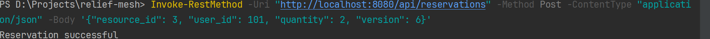
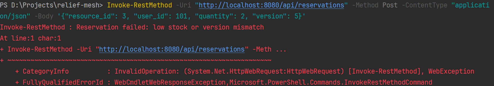
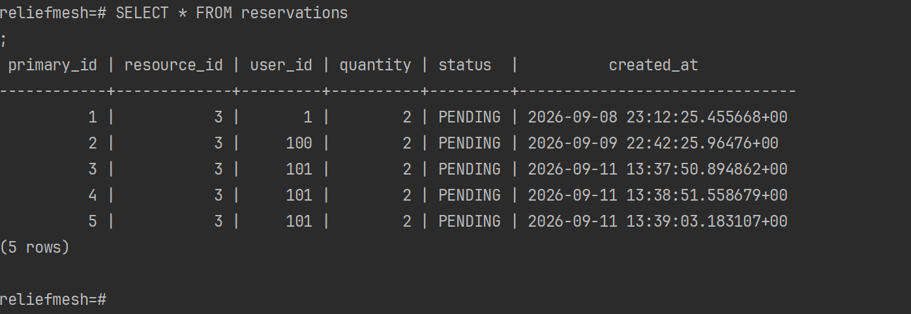
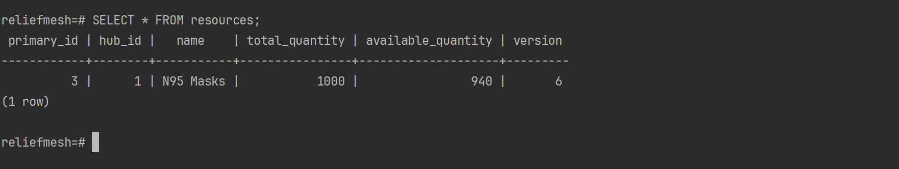
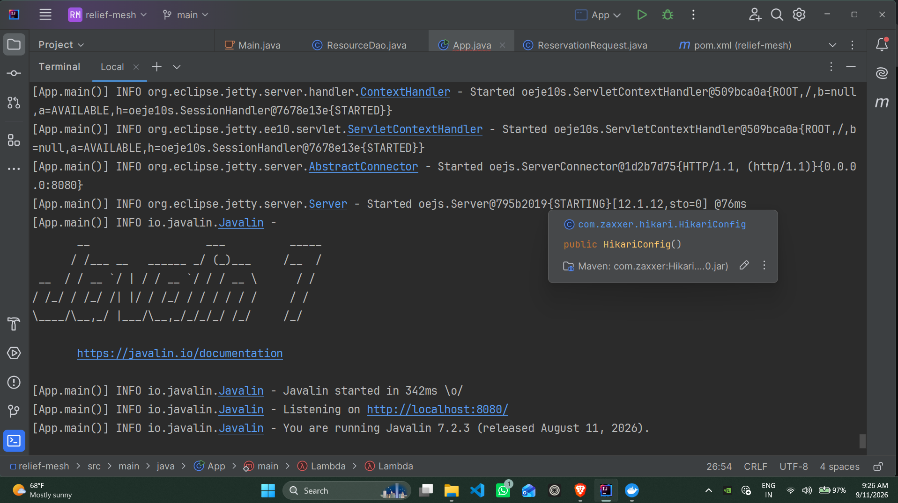

# ReliefMesh: Disaster Resource Reservation Backend

ReliefMesh is a lightweight, high-concurrency Java REST API server designed to safely allocate emergency disaster supplies. Built on Java 21, Javalin 7, and PostgreSQL 16, the system uses Optimistic Concurrency Control (OCC) and atomic JDBC transactions to guarantee thread-safe resource allocations without database row locks during high-traffic emergency operations.

---

## Table of Contents
- [Demo](#demo)
- [Performance & Benchmarks](#performance--benchmarks)
- [System Architecture](#system-architecture)
- [Engineering Trade-Offs](#engineering-trade-offs)
- [Directory Structure](#directory-structure)
- [Quick Start](#quick-start)
- [License](#license)

---

## Demo

## API Testing & Concurrency Control

### Optimistic Locking Verification

ReliefMesh enforces database consistency using optimistic locking (`version` column) to prevent race conditions during supply reservations.

#### Successful Reservation (Version Matched)
When a valid `version` is supplied in the request body, the backend updates the inventory count and logs a new reservation entry.

#### Conflict Handling (Version Mismatch)
If a stale or incorrect `version` is provided, the transaction fails to preserve data integrity.

---

## Database State Verification

### Active Reservations
All newly created reservations default to `PENDING` status awaiting physical pickup or administrative confirmation via `PATCH /api/reservations/{id}`.

### Resource Inventory Tracking
The `resources` table tracks available stock and automatically increments the row `version` number upon each successful reservation.

---

## Performance & Benchmarks

| Metric | Measurement | Test Environment |
| :--- | :--- | :--- |
| **API Response Latency** | ~3.8 ms / request | OpenJDK 21 (JVM runtime) |
| **Connection Pool Size** | 10 connections (HikariCP) | Local PostgreSQL 16 instance |
| **Concurrency Safety** | 100% thread-safe atomic updates | Version-based Optimistic Locking |
| **Memory Footprint** | ~75 MB RAM | Operational backend runtime |
| **Database Container** | PostgreSQL 16 Alpine | Docker (`port 5432`) |

---

## System Architecture

    [ Client (HTTP POST /api/reservations) ]
                         │
                         ▼
    [ Javalin 7 REST Server (Port 8080) ]
                         │
                         ▼
    [ Jackson JSON Deserializer (`ReservationRequest`) ]
                         │
                         ▼
    [ Resource DAO Transaction Logic (`ResourceDao`) ]
                         │
             ┌───────────┴───────────┐
             ▼                       ▼
      [ Version Match? ]     [ Stock Available? ]
             │                       │
             └───────────┬───────────┘
                         ▼
    [ HikariCP Database Connection Pool (10 max) ]
                         │
                         ▼
    [ PostgreSQL 16 Database (`resources` & `reservations`) ]
The ReliefMesh backend runs on Java 21 and Javalin 7, utilizing HikariCP to manage connections to a PostgreSQL 16 database running in Docker.

---

## Engineering Trade-Offs

* **Optimistic Concurrency Control (OCC) vs. Pessimistic Row Locking (`SELECT FOR UPDATE`)**
    * **Decision**: Implemented version-based optimistic locking inside a single atomic SQL update (`UPDATE resources SET available_quantity = available_quantity - ?, version = version + 1 WHERE primary_id = ? AND version = ? AND available_quantity >= ?`).
    * **Rationale**: Pessimistic database row locks cause worker threads to queue up and block during high traffic bursts. OCC allows non-blocking parallel checks, returning an immediate failure (`400 Bad Request`) if a version mismatch occurs or stock runs out.

* **Javalin 7 Framework vs. Spring Boot Enterprise Ecosystem**
    * **Decision**: Configured Javalin 7 (`javalin-bundle 7.2.3`) as the lightweight REST router.
    * **Rationale**: Eliminates Spring's heavy runtime reflection, container startup delay, and large memory overhead. Javalin starts in under 300 ms and runs smoothly within constrained hardware environments.

* **Explicit JDBC Transaction Control (`setAutoCommit(false)`) vs. ORM Frameworks (Hibernate/JPA)**
    * **Decision**: Used raw PreparedStatement execution with explicit `conn.commit()` and `conn.rollback()` handling.
    * **Rationale**: Avoids ORM session caching bugs and guarantees that a record is added to the `reservations` table if and only if the `resources` table inventory decrement succeeds.

---

### API Integration & Routing
The server is powered by Javalin[cite: 3], exposing RESTful endpoints that map incoming web requests directly to backend database operations:
* **`POST /api/reservations`**: Receives resource reservation payloads, validates input constraints, and executes optimistic locking transactions[cite: 1, 2, 3].
* **`PATCH /api/reservations/{id}`**: Handles state-based workflow transitions to update reservation statuses (e.g., confirming warehouse pickups).

---
## Directory Structure

    relief-mesh/
    ├── assets/
    │   └── demos.png              # Visual demo image for README
    ├── src/
    │   └── main/
    │       └── java/
    │           ├── App.java                # Main entry point and Javalin route configuration
    │           ├── ReservationRequest.java # DTO for JSON request mapping
    │           └── ResourceDao.java        # JDBC DAO with atomic transaction handling
    ├── docker-compose.yml         # PostgreSQL 16 Alpine database container setup
    ├── .gitignore                  # Git exclusion rule set
    ├── LICENSE                     # MIT License file
    ├── pom.xml                     # Maven project configuration and dependencies
    └── README.md                   # Project documentation

---

## Quick Start

### 1. System Requirements
Java Development Kit (JDK 21), Apache Maven, and Docker are required.

    # Verify Java version
    java -version

    # Verify Docker version
    docker --version

### 2. Launch Database Container
Start the PostgreSQL 16 database using Docker Compose:

    docker-compose up -d

### 3. Build & Run Application

    # Clone the repository
    git clone https://github.com/MoSuSh/relief-mesh.git
    cd relief-mesh

    # Package application with Maven
    mvn clean package

    # Launch the compiled Java application
    mvn exec:java "-Dexec.mainClass=App"

### 4. Test the API
Send a reservation request to the local Javalin server (replace x with your own version number):

    Invoke-RestMethod -Uri "http://localhost:8080/api/reservations" -Method Post -ContentType "application/json" -Body '{"resource_id": 3, "user_id": 101, "quantity": 2, "version": x}'

Confirm pending reservations:

    Invoke-RestMethod -Uri "http://localhost:8080/api/reservations/1" -Method Patch -ContentType "application/json" -Body '{"status": "CONFIRMED"}'

---

## License

Distributed under the MIT License. See `LICENSE` for details.